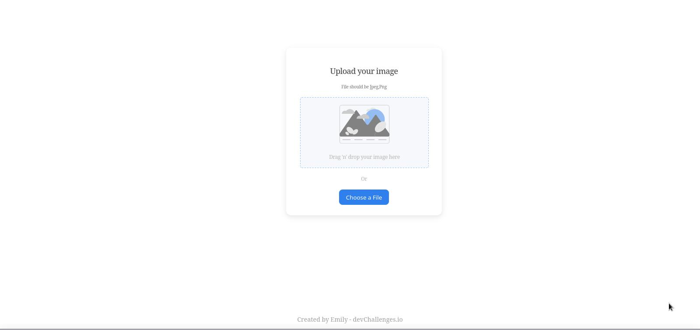

<!-- Please update value in the {}  -->

<h1 align="center">Image Uploader</h1>

<div align="center">
   Solution for a challenge from  <a href="http://devchallenges.io" target="_blank">Devchallenges.io</a>.
</div>

<div align="center">
  <h3>
    <a href="/">
      Demo
    </a>
    <span> | </span>
    <a href="https://github.com/emily883/ImageUploader">
      Solution
    </a>
    <span> | </span>
    <a href="https://devchallenges.io/challenges/O2iGT9yBd6xZBrOcVirx">
      Challenge
    </a>
  </h3>
</div>

<!-- TABLE OF CONTENTS -->

## Table of Contents

- [Overview](#overview)
  - [Built With](#built-with)
- [Features](#features)
- [How to use](#how-to-use)
  - [Using Docker Front-End](#using-docker)
- [Contact](#contact)
- [Acknowledgements](#acknowledgements)

<!-- OVERVIEW -->

## Overview



A website where you can upload a photo and share it with your friends and family.

### Built With

- [React](https://reactjs.org/)


## Features

<!-- List the features of your application or follow the template. Don't share the figma file here :) -->

This application/site was created as a submission to a [DevChallenges](https://devchallenges.io/challenges) challenge. The [challenge](https://devchallenges.io/challenges/O2iGT9yBd6xZBrOcVirx) was to build an application to complete the given user stories.

## How To Use


<br />

```bash
# Clone this repository
$ git clone https://github.com/emily883/ImageUploader

# Go into the project's folder
$ cd ImageUploader
```


To clone and run this application, you'll need [Git](https://git-scm.com) and [Node.js](https://nodejs.org/en/download/) (which comes with [npm](http://npmjs.com)) installed on your computer. From your command line. First lets start the api:

## Api

```bash
# Go into your api folder
$ cd api 

# Install dependencies
$ npm install

# Run the app
$ npm start
```

## Client Side

Then lets start the Client side

```bash

$ cd client 

# Install dependencies
$ npm install

# Run the app
$ npm start
```

<br />

# Using Docker

<br />

Make sure your [Api](#api) its running. You'll need to have [Docker](https://www.docker.com/) installed on your system and **running**.

<br />

```bash
# Go to Client folder
$ cd client

# Runs docker compose
$ docker compose up
```

<br />

It will takes a while but ones its all done you can go to your [localhost:8080](https://localhost:8080), make sure its on port **8080**.

<br />


## Acknowledgements

- [Steps to replicate a design with only HTML and CSS](https://devchallenges-blogs.web.app/how-to-replicate-design/)
- [Node.js](https://nodejs.org/)
- [Marked - a markdown parser](https://github.com/chjj/marked)

## Contact

- Website [emily-cruz.ml](http://www.emily-cruz.ml/)
- GitHub [@emily883](https://github.com/emily883)
